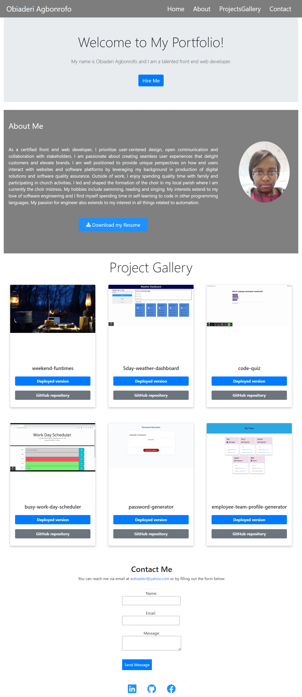

# react-portfolio

## Description
This portfolio has been created for my career as a front end web developer using react.It showcases my skills and talents to employers looking to fill a part-time or full-time position.
The react-portfolio webpage includes a navigation bar cards with placeholder images for completed projects as well as a photo and download resume placeholder.It also has placeholder links to contact details at the bottom of the page,

## Screenshot

The following image shows the web application's appearance and functionality:

## Link

Below is a link to the react-portfolio webpage:

* [react-portfolio](https://aobiaderi.github.io/my-react-portfolio/)